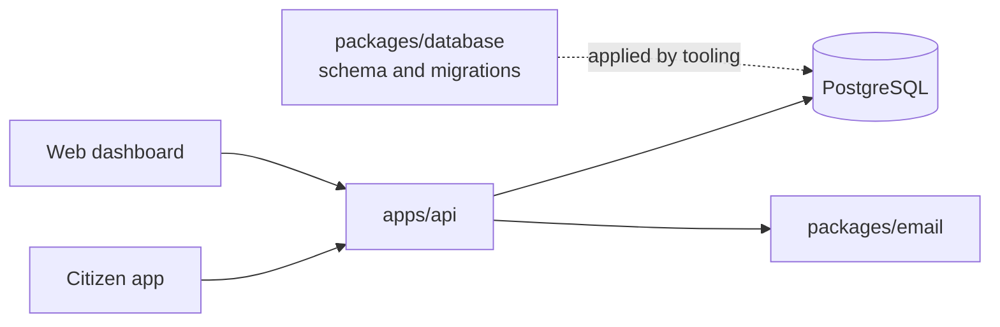
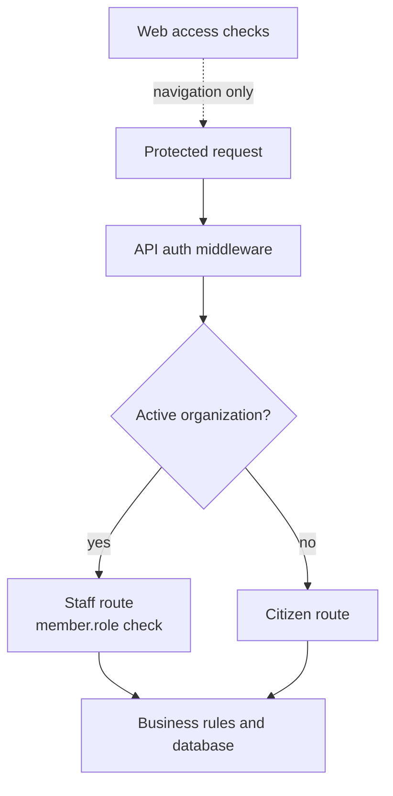

# Architecture

Lima Limpia has one data owner: `apps/api`. The clients render screens and send
HTTP requests. They do not write to PostgreSQL.

## Runtime flow



- `apps/api` runs the Hono application and owns authentication, authorization,
  validation, business rules, and persistence.
- `apps/web` is a Next.js dashboard. Its server actions call the API and pass
  the session cookie through to it.
- `apps/citizen` is an Expo client. It calls the API from the device and stores
  the local session hint in Expo Secure Store.
- `packages/database` defines the schema and migration files. The API currently
  creates its own `pg` pool and runs parameterized SQL.
- `packages/email` renders the password reset email.

`apps/server` is a standalone `json-server` prototype. It is not connected to
the API or the production database.

## API structure

The API uses a small layered structure under `apps/api/src/internal`:

```text
domains/<name>/
  handler.ts       HTTP routes and request parsing
  service.ts       business rules and failure decisions
  repository.ts    database access
  queries.ts       parameterized SQL
  schemas.ts       Zod request schemas
  models.ts        TypeScript types
```

Not every domain has every file. `admin`, `auth`, `citizen`, `driver`, and
`health` expose handlers. `trucks`, `routes`, `assignments`, `issues`, and
`locations` provide data used by those handlers.

The container in `internal/container/container.ts` is the composition root. It
creates the database, repositories, services, middleware, and handlers. Register
new dependencies there.

Repositories run parameterized SQL through `pg`. Drizzle is used for schema
definition and migrations, not for API query building. Use
`Database.withTransaction` when related writes must succeed or fail together.

## Authentication and roles

Better Auth manages email/password sessions and organization membership. Clients
send the session cookie with protected requests.

There are two role concepts:

- `user.role` is Better Auth's global role. It is not the source of staff access
  checks.
- `member.role` is the role in the active organization. Staff routes check this
  value. The current roles are `owner`, `admin`, `supervisor`, and `driver`.

Citizens are authenticated users without an active organization. The citizen
middleware rejects a session that has an active organization. Staff middleware
requires both an active organization and an allowed member role.

The web app checks access in its middleware and server actions. The API checks
it again. The client check improves navigation; the API check is the security
boundary.



## Database ownership

Only `apps/api` may import `@lima-garbage/database`. Change the schema in
`packages/database/src/schema`, generate a migration, review the SQL, and apply
it to the intended database. Keep each migration SQL file with the matching
entry in `migrations/meta/_journal.json`.

The database package contains tables for authentication, organizations, routes,
assignments, trucks, locations, issues, messages, push tokens, and citizen
profiles.

## Data freshness

The citizen app polls truck data only while it is active. The API treats a truck
location as usable for citizen status only while it belongs to an active
assignment and was updated within the last ten minutes.

The web API client uses live responses by default. It opts into a short cache
only for list views that change less often.
