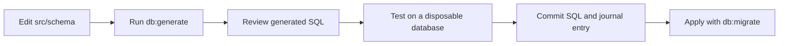

# Database package

`@lima-garbage/database` owns the PostgreSQL schema used by the API. It defines
tables with [Drizzle](https://orm.drizzle.team/docs/overview) and stores
generated migrations. The API currently creates its own `pg` pool and runs
parameterized SQL.

The API is the only workspace that may import this package. The web and citizen
apps call the API instead of connecting to PostgreSQL.

## Schema

Schema files live in [`src/schema`](src/schema):

- `auth.ts`: users, sessions, organizations, members, and invitations.
- `citizens.ts`: citizen profiles and education progress.
- `communications.ts`: dispatch messages and push notification tokens.
- `issues.ts`: citizen reports, driver reports, and system alerts.
- `locations.ts`: current truck locations and location history.
- `routes.ts`: routes, waypoints, schedules, and assignments.
- `trucks.ts`: truck records.

[`src/schema/index.ts`](src/schema/index.ts) exports the tables and defines all
Drizzle relations.

## Environment

The schema tools need `DATABASE_URL`. The setup and seed scripts also need
`BETTER_AUTH_SECRET`. `BETTER_AUTH_URL` is optional and defaults to
`http://localhost:4000`.

Copy [`../../.env.example`](../../.env.example) to `.env` and fill in the
values before running a command.

## Commands

Run these from the repository root:

```sh
bun --filter @lima-garbage/database db:generate
bun --filter @lima-garbage/database db:push
bun --filter @lima-garbage/database db:push:test
bun --filter @lima-garbage/database db:studio
```

Create the first organization owner with the interactive setup script:

```sh
bun --filter @lima-garbage/database setup:admin
```

The script prints the values needed by the seed script. Add them to `.env`, then
run:

```sh
bun --filter @lima-garbage/database db:seed
```

The seed script is for development data. It is safe to run more than once for
the records it owns, but it must not run against production data.

## Migrations

Schema changes follow this path:



Keep each migration SQL file with its matching entry in
[`migrations/meta/_journal.json`](migrations/meta/_journal.json). Do not apply
a migration until the complete history can be created on a fresh database.

`db:push` changes a database without recording a migration and is for local
development. `db:migrate` applies the committed migration files.

Do not edit generated migration snapshots by hand. If a migration needs a manual
change, document why in the migration review and make sure a fresh database can
still apply the complete migration history.
