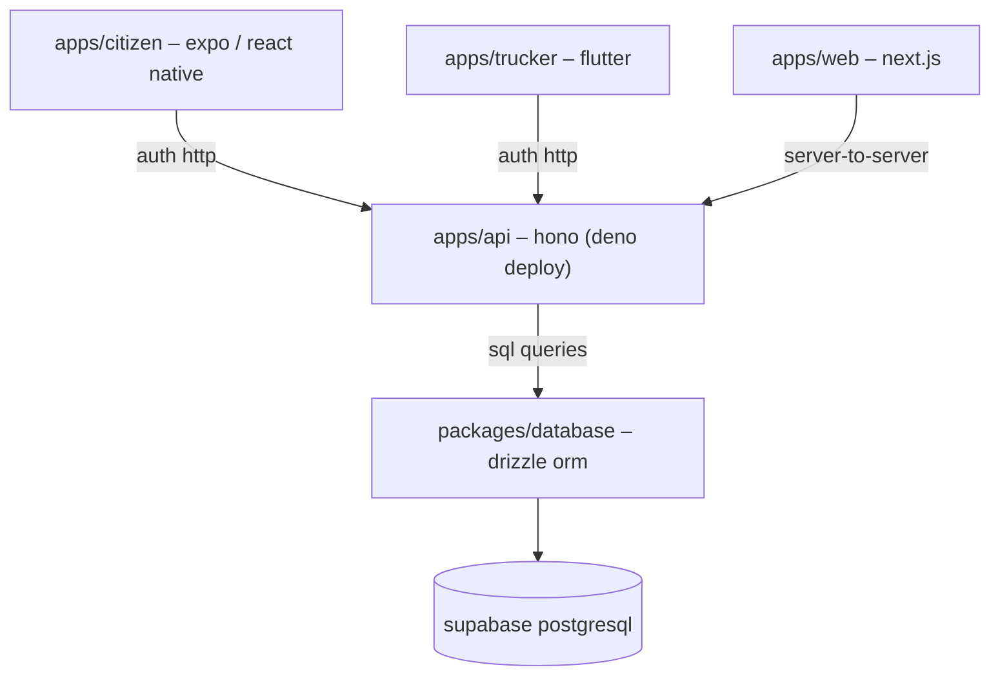

# [monorepo]: lima-limpia

@lima-limpia es un sistema de gestión de residuos urbanos que consiste de tres
aplicaciones cliente y una API central. Los clientes se comunican solo con la
API, que es la única autorizada a acceder directamente a la base de datos.

**El team**:

<!-- ALL-CONTRIBUTORS-LIST:START - Do not remove or modify this section -->
<!-- prettier-ignore-start -->
<!-- markdownlint-disable -->
<table>
  <tbody>
    <tr>
      <td align="center">
        <a href="http://totallynotdavid.github.io">
          <br />
          <sub><b>David Duran</b></sub>
        </a><br />
        <a href="#maintenance-totallynotdavid" title="Maintenance">🚧</a>
        <a href="#security-totallynotdavid" title="Security">🛡️</a>
      </td>
      <td align="center">
        <a href="https://github.com/PedroRojasF">
          <br />
          <sub><b>Pedro Rojas F</b></sub>
        </a><br />
        <a href="#maintenance-totallynotdavid" title="Maintenance">🚧</a>
        <a href="#ideas-PedroRojasF" title="Ideas">💡</a>
      </td>
      <td align="center">
        <a href="https://github.com/andrescosmemalaz">
          <br />
          <sub><b>Andrés Cosme Malaz</b></sub>
        </a><br />
        <a href="#maintenance-totallynotdavid" title="Maintenance">🚧</a>
      </td>
    </tr>
  </tbody>
</table>

<!-- markdownlint-restore -->
<!-- prettier-ignore-end -->
<!-- ALL-CONTRIBUTORS-LIST:END -->

**Nuestro stack**: TypeScript es el lenguaje principal del proyecto. Usamos
frameworks como Next.js para la web, la app de uso público en React Native con
Expo, la app de uso interno para choferes en Flutter y Supabase con PostgreSQL
como backend.

Adicionalmente, dependemos de los siguientes paquetes: better-auth para la
autenticación, drizzle-orm para el esquema, Tailwind CSS para los estilos,
Zustand para la gestión de estado.

**Deploy**: Las aplicaciones móviles se compilan con EAS, el
[CI de Expo](https://docs.expo.dev/build/building-on-ci/) y la API en
[Deno Deploy EA](https://docs.deno.com/deploy/early-access/).

## Guía rápida

Ejecuta todos estos comandos desde la raíz del proyecto.

1. Para generar y aplicar el esquema de base de datos:

   ```bash
   bun --filter @lima-garbage/database db:generate
   bun --filter @lima-garbage/database db:push
   ```

2. Para crear el usuario administrador:

   ```bash
   bun --filter @lima-garbage/database setup:admin
   ```

3. Para poblar la base de datos con datos de prueba:

   ```bash
   bun --filter @lima-garbage/database db:seed
   ```

4. Para iniciar el servidor de desarrollo de la API:

   ```bash
   bun --filter @lima-garbage/api dev
   ```

   Para asegurar que la API está funcionando correctamente:

   ```bash
   bun --filter @lima-garbage/api test
   ```

## Repositorios

1. **API ([apps/api](apps/api))**: Aplicación
   [hono](https://hono.dev/docs/getting-started/deno) desplegada en
   [Deno Deploy](https://console.deno.com/empirical). **Disponible en**
   [https://api-prod.empirical.deno.net/](https://api-prod.empirical.deno.net/)
   - Gestiona todas las operaciones de datos.
   - Autenticación con
     [better-auth](https://www.better-auth.com/docs/concepts/database); valida
     solicitudes.
   - Es el único componente autorizado a importar y usar
     `@lima-garbage/database`.

2. **App ([apps/citizen](apps/citizen))**: Aplicación pública desarrollada en
   [React Native con Expo](https://docs.expo.dev/develop/development-builds/introduction/).
   - Reporte de problemas de recolección, consulta de horarios y acceso a
     material educativo sobre clasificación de residuos.
   - Autenticación con
     [@better-auth/expo](https://www.npmjs.com/package/@better-auth/expo) y
     manejo del state con Zustand.

3. **App ([apps/trucker](apps/trucker))**: Aplicación interna en Flutter para
   operadores de recolección.
   - Gestión de rutas asignadas, actualización en tiempo real y registro de
     progreso.
   - Autenticación OAuth estándar mediante cliente HTTP Dio (TBA).

4. **Administración ([apps/web](apps/web))**: Aplicación interna en Next.js para
   supervisores y administradores.
   - Dashboards operativos, gestión de rutas y análisis de datos.
   - Implementa patrón Backend for Frontend (BFF), donde el servidor Next.js
     actúa como proxy hacia la API central.

5. **Esquema de la DB ([packages/database](packages/database))**: Paquete
   compartido que define el esquema en PostgreSQL con Drizzle ORM.
   - Exporta tipos TypeScript para consultas type-safe en la API.
   - No es ejecutable; funciona únicamente como definición de la capa de datos.



## Flujo de autenticación

Todas las aplicaciones cliente generan **tokens de sesión válidos**, que deben
enviarse en cada solicitud HTTP a la API, ya sea en headers de autorización o
cookies.

- [app/citizen](app/citizen) usa el SDK de `better-auth` para Expo, almacenando
  credenciales en el almacenamiento seguro del dispositivo.
- [app/trucker](app/trucker) implementa OAuth estándar con gestión manual de
  tokens.
- [app/admin-web](app/admin-web) gestiona autenticación a través de su backend
  en Next.js, que actúa como proxy de sesión hacia la API Hono.

## Reglas

Las modificaciones al esquema de base de datos deben realizarse en
[packages/database/src/schema](packages/database/src/schema/). Tras los cambios,
se generan las migraciones con `bun run db:generate` y se aplican en desarrollo
mediante `bun run db:push`. See
[package.json](packages/database/package.json?plain=1#L9).

La implementación de nuevas funcionalidades comienza siempre en `apps/api`,
creando un endpoint con el middleware de autenticación y validación
correspondiente. La lógica se define en el controlador, utilizando Drizzle para
las operaciones de base de datos. Una vez completado este paso, se continúa con
la integración en las aplicaciones cliente respectivas.

Las aplicaciones cliente se limitan a la interfaz de usuario, la gestión del
state (local) y la comunicación HTTP con la API. La validación de datos, la
lógica de negocio y la persistencia se centralizan exclusivamente en la API.
